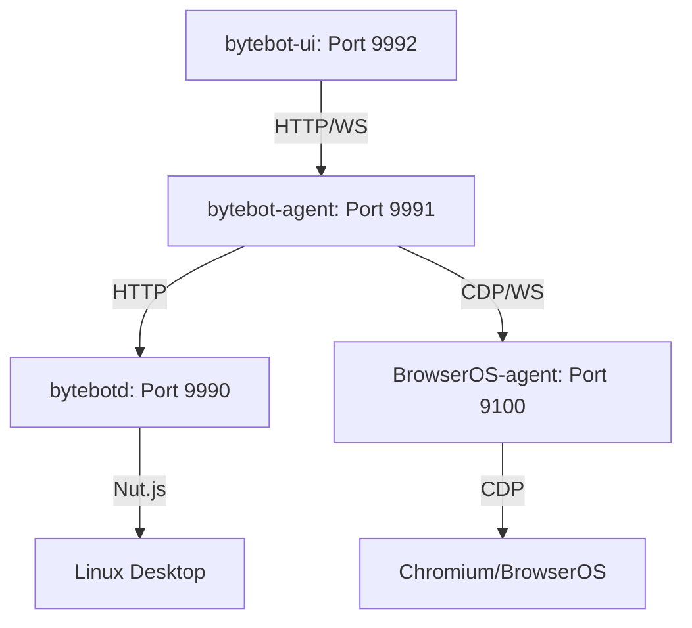

# Kronos OS Initialization Audit Report (May 2026)

## Overview
This report documents the status of the Kronos OS ecosystem, a multi-project monorepo containing AI-driven browser, agent, and desktop automation tools.

## Core Components and Tech Stack

### 1. BrowserOS Agent (`kronbot/kronosOS/packages/browseros-agent`)
- **Role:** Bun-based MCP server and Chrome extension bridge for intelligent browser automation.
- **Tech Stack:** Bun, TypeScript, Hono, WXT (Web Extension Toolbox).
- **Key Ports:** 9100 (Server), 9000 (CDP), 9300 (Extension).
- **Status:** Initialized (Dependencies installed, `.env.dev` created).

### 2. Kronbot Agent Orchestration (`kronbot/packages/`)
- **Role:** Agent orchestration platform for AI workflows with a virtual Linux desktop.
- **Tech Stack:** NestJS (Backend), Next.js (UI), Prisma (ORM), Docker.
- **Sub-packages:**
  - `bytebot-agent`: AI agent service (NestJS). Port 9991.
  - `bytebot-ui`: Task management UI (Next.js). Port 9992.
  - `bytebotd`: Desktop daemon (NestJS). Port 9990.
  - `shared`: Common utilities and types.
  - `bytebot-agent-cc`: Computer control agent.
- **Status:** Initialized (Dependencies installed, Prisma clients generated, `.env` created).

### 3. Website (`website/`)
- **Role:** Project landing page.
- **Tech Stack:** Static HTML/JS.
- **Status:** Ready.

## Architecture & Communication Flow

- **User Interaction:** Starts at `bytebot-ui`.
- **Orchestration:** `bytebot-agent` manages tasks and coordinates between AI providers and execution engines.
- **Desktop Control:** `bytebotd` handles low-level mouse/keyboard input on the virtual desktop.
- **Browser Automation:** `browseros-agent` provides high-level browser tools via MCP.

## Initialization Results
- [x] `shared` package built.
- [x] `bytebot-agent` dependencies installed and Prisma client generated.
- [x] `bytebot-agent-cc` dependencies installed and Prisma client generated.
- [x] `bytebot-ui` dependencies installed.
- [x] `bytebotd` dependencies installed.
- [x] `browseros-agent` dependencies installed (Bun).
- [x] Environment variables configured from templates.

## Test Results
- **bytebot-agent / bytebotd:** `npm test` executed but no `.spec.ts` files were found in `src/`.
- **browseros-agent:**
  - **Unit Tests:** `config.test.ts` and `page-collector.test.ts` passed (24/24 tests).
  - **Integration Tests:** Failed due to hardcoded macOS binary paths (`/Applications/BrowserOS.app`) which do not exist in the current Linux environment.

## Architectural Notes
- The root-level directories `BrowserOS/`, `EdgyArc-fr/`, and `desktop/` are empty placeholders.
- Active development and orchestration logic are located in `kronbot/`.
- `void/` and `kronos-browser/` mentioned in some documentation are missing from this specific environment.

---
*Generated by Jules, AI Software Engineer.*
